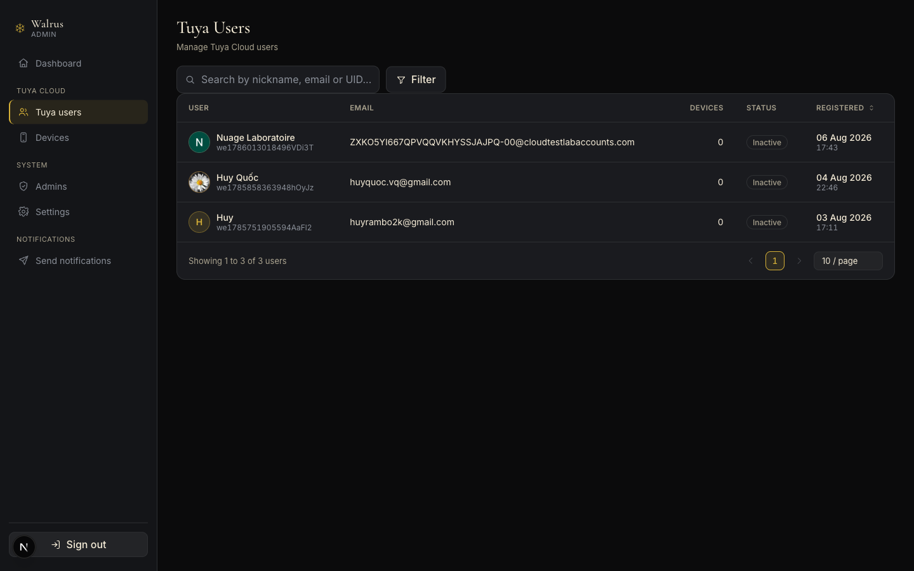
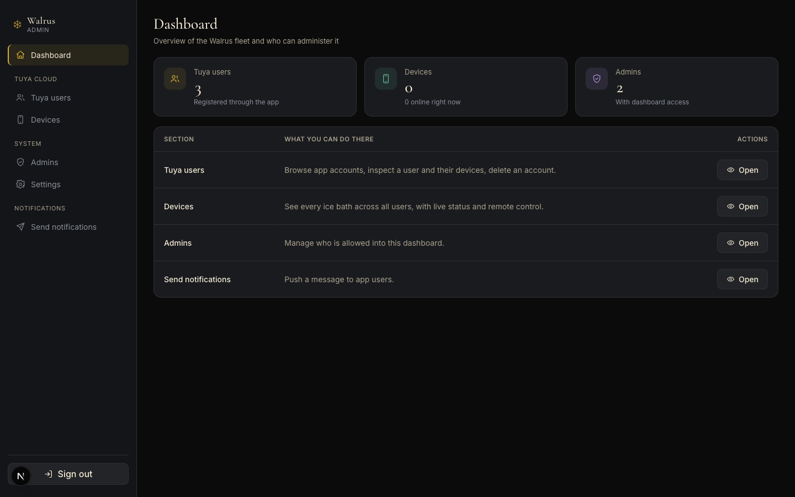
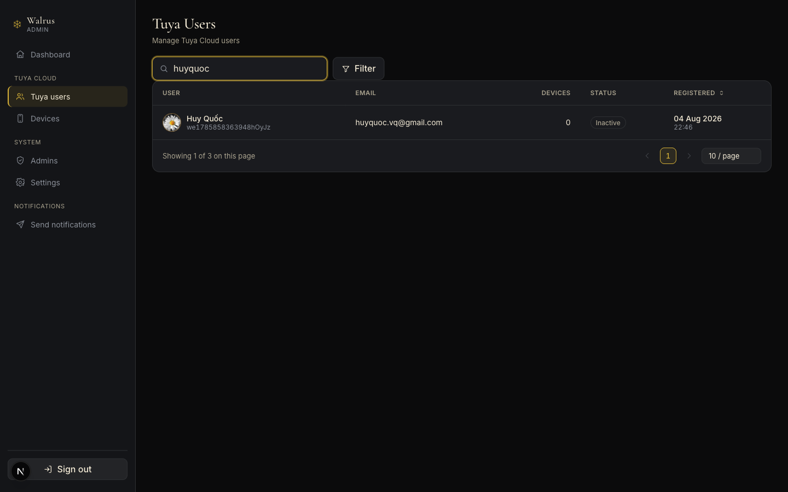
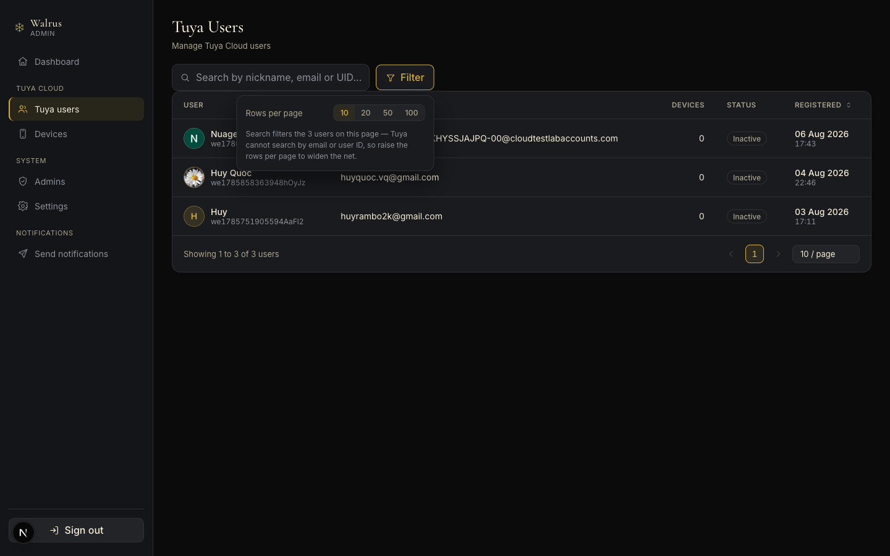
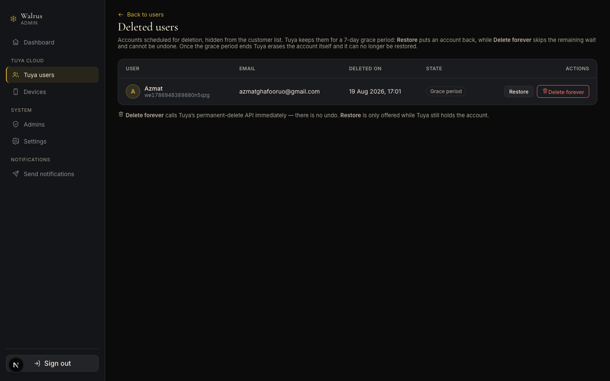
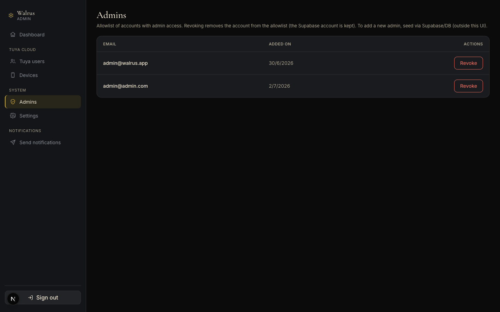
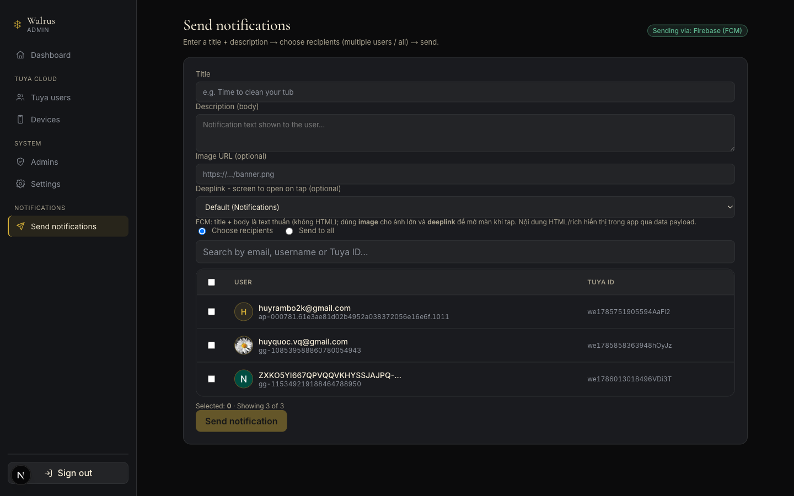
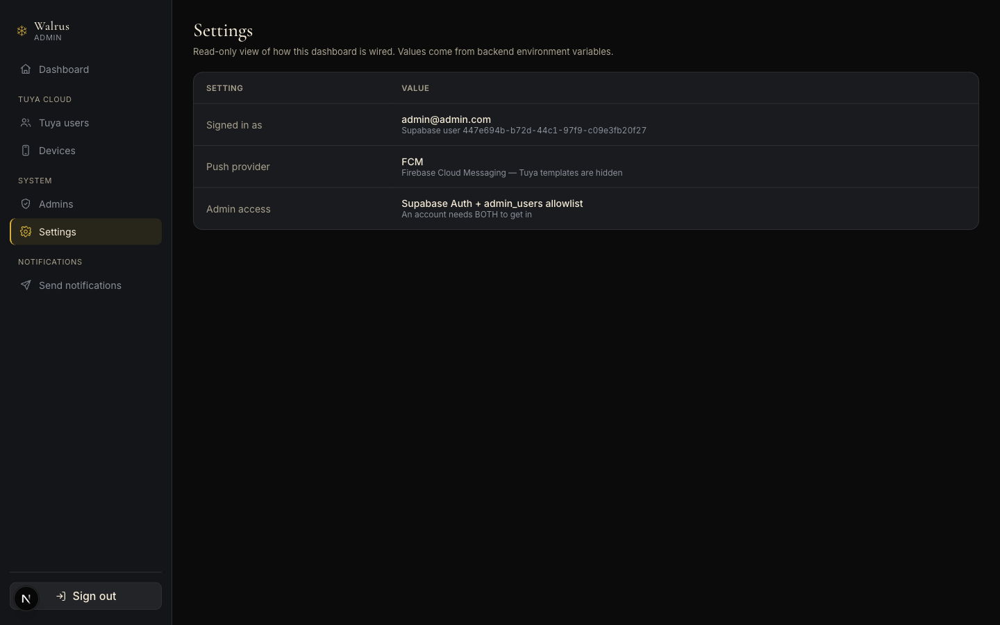
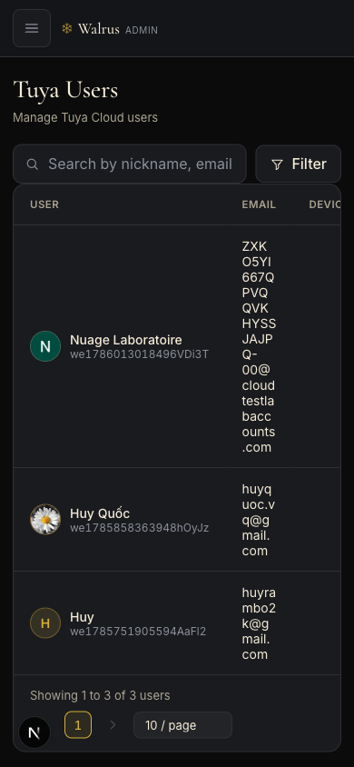
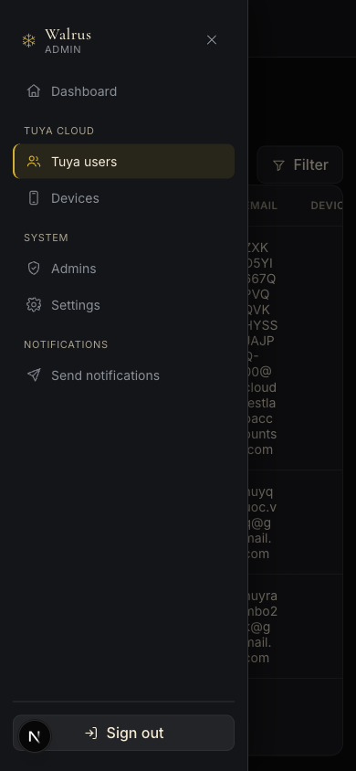

# Walrus Admin — User Guide

How to use the Walrus admin dashboard. Written for the people who operate it; no technical
background assumed.

Each section answers one "how do I…" question and is illustrated with a real screenshot.

> Need the technical reference (architecture, APIs, debugging)? See
> [admin-website.md](admin-website.md).

---

## Contents

1. [What you need](#1-what-you-need)
2. [Signing in and out](#2-signing-in-and-out)
3. [Finding your way around](#3-finding-your-way-around)
4. [Seeing the big picture](#4-seeing-the-big-picture)
5. [Browsing customers](#5-browsing-customers)
6. [Finding one customer](#6-finding-one-customer)
7. [Looking at one customer](#7-looking-at-one-customer)
8. [Deleting a customer](#8-deleting-a-customer)
9. [Managing tubs](#9-managing-tubs)
10. [Managing administrators](#10-managing-administrators)
11. [Sending notifications](#11-sending-notifications)
12. [Checking the configuration](#12-checking-the-configuration)
13. [Using it on a phone](#13-using-it-on-a-phone)
14. [When something goes wrong](#14-when-something-goes-wrong)

---

## 1. What you need

| | |
|---|---|
| **Device** | A computer, or a phone — both work |
| **Browser** | A recent Chrome, Edge, Safari or Firefox |
| **Account** | An email and password issued by an existing administrator |

No account yet? An existing administrator **cannot create one for you** from the dashboard — that
step happens in the underlying system. See [section 10](#10-managing-administrators).

---

## 2. Signing in and out

### Signing in

1. Open the dashboard address.
2. Type your **Email** and **Password**.
3. Press **Sign in**.

You land straight on the customer list.

### If it refuses you

The message *"Incorrect email or password, or the account lacks admin access."* covers **two**
cases:

- the email or password is wrong, **or**
- the password is right but the account has not been granted admin access.

The system deliberately does not distinguish them, so outsiders cannot discover which addresses are
administrators. If you are certain the password is correct, ask another administrator to check that
your email is on the access list.

### Signing out

Press **Sign out** at the bottom left.

> Your session expires by itself after **8 hours**. When it does, the dashboard returns to the
> sign-in screen — just sign in again, nothing is lost.

---

## 3. Finding your way around

The screen has two parts: a **menu on the left** that stays put, and the **content on the right**
that changes with the section you pick. Scrolling the page does not move the menu.

The menu is grouped:

| Group | Item | What it is for |
|---|---|---|
| | **Dashboard** | A quick overview |
| **TUYA CLOUD** | **Tuya users** | Customers using the app |
| | **Devices** | Every tub, and remote control |
| **SYSTEM** | **Admins** | Who may enter this dashboard |
| | **Settings** | Configuration (read-only) |
| **NOTIFICATIONS** | **Send notifications** | Push a message to customers' phones |

The section you are in has a **gold bar on its left** and a lighter background.

---

## 4. Seeing the big picture

Press **Dashboard**. Three figures:

- **Tuya users** — how many customers have registered through the app
- **Devices** — how many tubs exist, and how many are switched on
- **Admins** — how many people can enter this dashboard

Below is a shortcut table; press **Open** to jump to a section.

> If a figure shows **—** and *"Could not reach…"*, that part could not fetch its data right now.
> The other figures are still correct. Reload the page; if it persists see
> [section 14](#14-when-something-goes-wrong).

---

## 5. Browsing customers

Press **Tuya users**. This is the screen you will use most.

### The columns

| Column | Contents |
|---|---|
| **User** | Picture, display name, and the customer ID underneath |
| **Email** | The email the customer registered with |
| **Devices** | How many tubs they own |
| **Status** | `Active` or `Inactive` — please read the warning below |
| **Registered** | Date and time they signed up |

**Click anywhere on a row** to open that customer's page.

> ⚠️ **`Inactive` does NOT mean the account is blocked.** Tuya provides no account status, so this
> is worked out for you: a customer who **has paired at least one tub** shows `Active`, one who
> **has not paired anything yet** shows `Inactive`. Somebody who just signed up always reads
> `Inactive` until they pair their first tub. Hover the badge and you will see this note.

### Sorting by sign-up date

Click the **Registered** column header to flip between newest-first and oldest-first.

### Moving between pages

At the bottom: **‹** and **›** to step back and forward, plus clickable page numbers
(`1 2 3 … 21`). The line *"Showing 1 to 3 of 3 users"* tells you which rows you are looking at and
how many there are in total.

---

## 6. Finding one customer

Type in the **Search** box above the table. The list filters as you type — no need to press Enter.

It matches: **display name**, **account name**, **email**, **phone number** and **customer ID**.

> ⚠️ **It only searches the rows currently on screen.** If the customer you want is on page 3 while
> you are on page 1, they will not appear. The fix: raise the rows per page to 100 first, then
> search.

While filtering, the line under the table changes to *"Showing 1 of 3 on this page"* to remind you
that you are looking at a filtered view.

Clear the box to get the full list back.

### Changing how many rows you see

Two ways, same result:

- Press **Filter** next to the search box → pick **10 / 20 / 50 / 100**.
- Or use the **"10 / page"** box at the bottom right of the table.

---

## 7. Looking at one customer

Click **anywhere on their row** in the list.

The top shows the customer's name, their customer ID (with a copy button), country, sign-up date
and number of tubs.

The page has three blocks:

**Account Information** — customer ID, account name, display name, email, phone, country, time
zone, the temperature unit they use in the app, when the account was created, and when the profile
was last changed.

**Summary** — total tubs, how many are on, how many are off, how many device links are stored in
our system, and the last profile change.

**Tuya Info** — how they registered (Google, Apple, email…), temperature unit, time zone.

> ⚠️ **User source** is also worked out rather than supplied: the system reads the prefix of the
> account name (`gg-` means Google, `ap-` means Apple, and so on). Tuya does not provide it.

The page ends with **Devices** — one card per tub showing its name, Online/Offline state, the
device ID (copyable), the product, when it was last online, and two figures: **Current Temp.** (the
water right now) and **Target Temp.** (what the customer asked for).

Press **← Back to users** to return.

### Seeing all of a customer's tubs

If a customer has several tubs, press **View all devices →** in the Devices block.

The full table: tub name, device ID, product, status, current temperature, target temperature, time
zone, created date and last update. It has its own search box for **tub name, device ID or
product**, and the **Device Name**, **Product** and **Status** headers sort when clicked.

Press **← Back to user detail** to return.

---

## 8. Deleting a customer

Deleting happens in two stages, and the first one **can be undone**.

1. Open the customer's page (click their row).
2. Check the email and the customer ID — many accounts have very similar names.
3. Press **Delete user** at the top right and confirm.

The customer disappears from the list straight away. They are **not gone yet**: the account moves
into *Deleted users* and waits there for **seven days** before it is erased for good.

### Getting a customer back

Go to **Settings → Deleted users** and press **Restore** on their row. The account returns to the
customer list exactly as it was.

> ⏳ Restore only works during the seven days. After that the account is erased automatically and
> **cannot be recovered by anyone**.

### Removing someone immediately

On the same *Deleted users* page, **Delete forever** skips the remaining wait.

> 🔴 **THIS CANNOT BE UNDONE.** There is no recovery afterwards, so use it only when you are certain.

> The delete button exists **only on the customer's own page** — never in the list — so you always
> pass through one more screen and have a chance to check. The *Deleted users* page lives under
> Settings for the same reason: it is not something to stumble into while browsing customers.

---

## 9. Managing tubs

Press **Devices** to see every tub belonging to every customer:

| Column | Meaning |
|---|---|
| **Device** | The tub's name |
| **Owner** | Which customer it belongs to |
| **Status** | On, or offline |
| **Current** | Water temperature right now |
| **Target** | The temperature the customer set |

Click a tub to open its control page, where you can change the target temperature and toggle
functions.

> 🔴 **These commands reach the real tub.** Changing the temperature here changes it in the
> customer's home. Only do it while helping that customer, and while they know you are doing it.

An offline tub cannot be controlled — wait until the customer powers it back on.

### If the table is empty

*"No devices found on any user account."* means **no customer has paired a tub yet**. That is a
normal message, not an error.

---

## 10. Managing administrators

Press **Admins** to see who may enter the dashboard and when they were granted access.

### Revoking access

Press **Revoke** on that row. They lose access immediately. Their account itself **still exists** —
it just no longer has admin rights.

> 🔴 **Two important warnings:**
>
> 1. The dashboard **does not stop you revoking your own access**. Do that and you are locked out
>    at once.
> 2. Revoke every administrator and **nobody can get back in**, including you. Recovery then needs
>    a developer to edit the database directly.
>
> Always keep **at least two** administrator accounts.

### Adding an administrator

**This cannot be done from the dashboard.** A developer must perform two steps in the underlying
system: create the account, then add the email to the access list. Miss the second step and the
person is refused at sign-in.

Send the email address of the person to your development team.

---

## 11. Sending notifications

Press **Send notifications**.

### The fields

| Field | Required | Notes |
|---|---|---|
| **Title** | ✅ | Shown in bold on the phone. Keep it short |
| **Description (body)** | ✅ | The main text |
| **Image URL** | — | A banner image; can be left empty |
| **Deeplink** | — | Which screen opens when the customer taps the notification |

Choose *Default (Notifications)* under **Deeplink** if you only want to inform. Choose *Device
detail*, *Tracking / Progress* or *Shop* to send them somewhere specific.

### Choosing who receives it

Two modes:

- **Choose recipients** — tick customers individually. There is a search box for email, account
  name or customer ID.
- **Send to all** — everybody.

> The manual picker lists at most **100 customers**. Beyond that you must use *Send to all*.

### Sending

Press **Send notification**.

> 🔴 **This cannot be recalled.** The notification reaches phones almost immediately. Re-read the
> title and body before pressing. With *Send to all*, check twice.
>
> **Recommended:** send to yourself first (tick your own account), check how it looks on the phone,
> then send it widely.

The small line at the top tells you which channel is being used (for example *Sending via: Firebase
(FCM)*).

---

## 12. Checking the configuration

Press **Settings**. This page is **read-only** by design:

- which account you are signed in as
- which channel notifications go through
- how admin access is granted

Changing these requires a developer, as they live in the server configuration.

---

## 13. Using it on a phone

The dashboard works on a phone as well as a computer.

On a narrow screen the menu is hidden to leave room for the content. Press the **☰ button** at the
top left to slide it out:

- Pick any item and the menu closes by itself.
- To close it without going anywhere: tap the dimmed area beside it, the **×**, or press Escape.
- Wide tables scroll **sideways within their own frame** — swipe left and right across the table to
  reach the remaining columns. The page itself never slides sideways, so the row count and page
  buttons stay where you expect them.

---

## 14. When something goes wrong

### The page says "This page couldn't load"

The system behind the dashboard could not return its data right now. **You did nothing wrong.**

1. Press **Reload** on the page, or refresh the browser.
2. If it persists, try another menu item — if only one section fails, that narrows it down.
3. Still stuck: tell your development team, giving the **section name**, the **time**, and the
   **number** shown under the error message. That number lets them find the right log entry.

### It threw me back to the sign-in screen

Sessions expire after 8 hours. Sign in again and carry on; nothing is lost.

### I cannot find a customer who just registered

Raise the rows per page to 100, then search again. Remember the search box **only filters the page
you are looking at**.

### The Devices table is empty

Normal when no customer has paired a tub. Not an error.

### The copy button does nothing

Browsers only allow copying over a secure connection. If you opened the dashboard over a plain
`http` address, select the text and copy it manually.

---

## What this dashboard cannot do

So you do not go looking:

| Task | Where it happens instead |
|---|---|
| Add a new administrator | A developer, in the underlying system |
| Change an administrator's password | The Supabase console |
| Edit anything on the Settings page | Server configuration |
| Create a customer account | Customers register themselves in the app |
| Pair a tub to an account | Customers do it themselves in the app |
| See a history of sent notifications | Not available yet |
