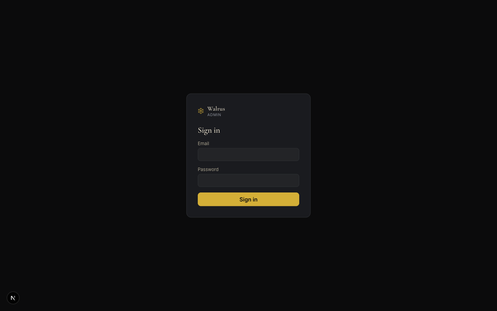
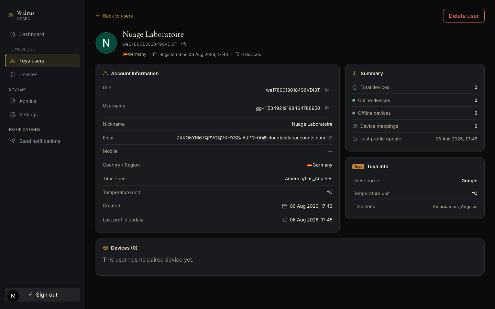
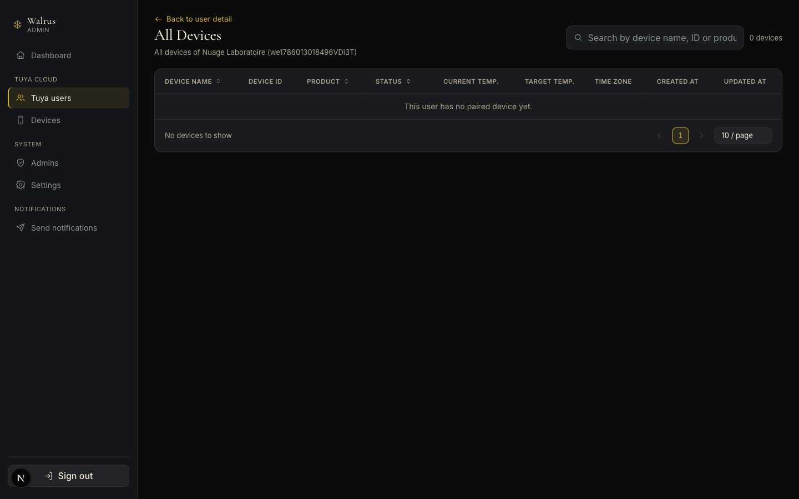
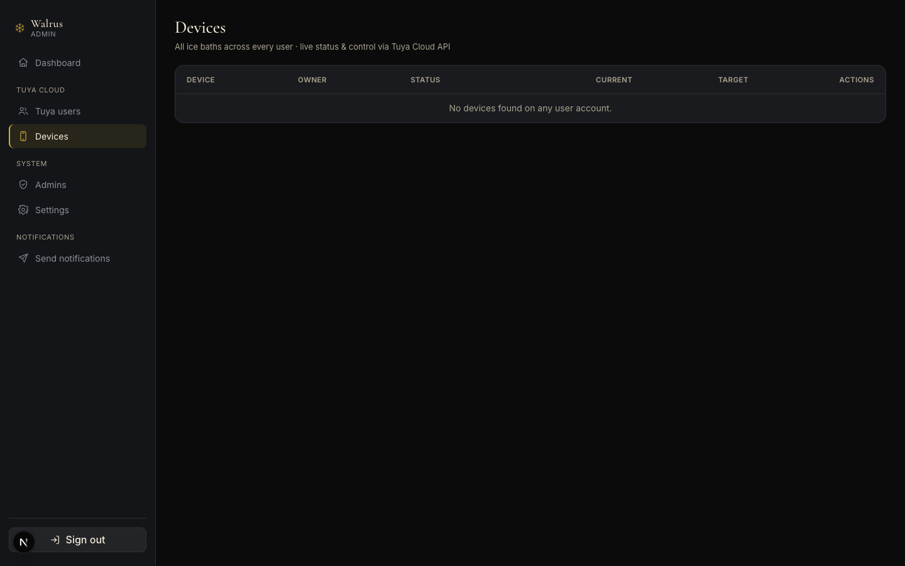

# Walrus Admin — Operations Reference

How the Walrus admin dashboard works: signing in, what each screen does, which actions cannot be
undone, and where to look when something breaks.

- **Audience:** day-to-day operators (browsing users, controlling tubs, sending notifications) and
  developers picking the project up.
- **Method:** every screen was walked on a running build with Playwright. Every number and label
  below was read from the DOM or from computed styles — nothing is described from memory.
- **Screenshots:** taken during the same pass, stored in [`docs/images/admin/`](images/admin/).
  They show real data from the dev environment at capture time.
- **Not verified:** the **send notification** flow stops at filling in the form. Pressing Send
  pushes to real phones and cannot be recalled. See [§8](#8-send-notifications--notifications).

> Looking for a click-by-click manual for operators? See [admin-user-guide.md](admin-user-guide.md).

---

## 1. Overview

| | |
|---|---|
| What it is | Internal dashboard for the Walrus ice bath ecosystem |
| Stack | Next.js App Router (Server Components) · no UI framework, plain CSS |
| Data source | **Never** talks to Tuya or the database directly — everything goes through the NestJS backend |
| Who gets in | An account present in Supabase Auth **and** in the `admin_users` allowlist |
| UI language | English |

The call chain — the most commonly misunderstood part:

```
Browser ──► Next.js (server) ──► NestJS backend ──► Tuya Cloud OpenAPI
                                        └────────► Supabase (Postgres)
```

Admin pages render on the **server**, so opening DevTools → Network will **not** show the backend
calls. Debugging means reading the Next.js or backend logs, not the Network tab.

---

## 2. Authentication and sessions



### Signing in

1. Open `/` — it redirects to `/users`, which redirects to `/login` when signed out.
2. Enter **Email** and **Password**, press **Sign in**.
3. On success you land on `/users`.

A wrong password **and** a valid password on a non-allowlisted account produce the *same* message:
*"Incorrect email or password, or the account lacks admin access."* That is deliberate — it stops
an outsider probing which addresses are admins.

### Session

| | |
|---|---|
| Cookie | `admin_token`, `httpOnly`, `sameSite=lax` |
| Lifetime | **8 hours** (`maxAge = 60*60*8`) |
| `secure` | only when `NODE_ENV=production` |
| Expiry | any API returning 401/403 redirects to `/login` |

The cookie is `httpOnly`, so browser JavaScript cannot read the token — by design.

**Sign out** at the bottom of the sidebar clears the cookie and returns to `/login`. It does **not**
revoke the token on Supabase; that token stays valid until it expires.

### Adding an admin

Two steps are required — miss either and the account cannot get in:

1. Create the user in **Supabase Auth**.
2. `INSERT` that email into the **`admin_users`** table.

The admin UI **cannot** do this. The Admins screen only revokes.

---

## 3. Shell and navigation

The sidebar is 248px wide and **pinned**: `position: sticky; top: 0`, full viewport height. Scroll
the page as far as you like and it stays put. When the menu itself is taller than the screen, only
the nav list scrolls — the logo and Sign out never leave the viewport.

| Group | Item | Path |
|---|---|---|
| — | Dashboard | `/dashboard` |
| **Tuya Cloud** | Tuya users | `/users` |
| | Devices | `/devices` |
| **System** | Admins | `/admins` |
| | Settings | `/settings` |
| **Notifications** | Send notifications | `/notifications` |
| | Templates *(hidden while provider = FCM)* | `/notifications/templates` |

The active item carries a gold left border, a gold-tinted background, and a gold icon.

On narrow screens the sidebar becomes a slide-in drawer — see [§12](#12-responsive).

---

## 4. Dashboard — `/dashboard`


Three counters, each read from the backend:

| Card | Source | Sub-line |
|---|---|---|
| Tuya users | `GET /users?page_no=1&page_size=1` → `total` | Registered through the app |
| Devices | `GET /admin/devices` → array length | *n* online right now |
| Admins | `GET /admin/users` → array length | With dashboard access |

Below is a shortcut table into the four main areas.

> **Failure isolation:** each source is wrapped in its own `try/catch`. A failing upstream call
> degrades that one card to `—` plus *"Could not reach…"*; the other two still render. This is the
> lesson from the Tuya `1106 permission deny` incident, which blanked Users and Devices together.

---

## 5. Tuya users — `/users`


The most-used screen. End users who registered through the app.

### 5.1 Table

| Column | Contents |
|---|---|
| User | Avatar (Google picture, or the initial on a colour derived from the uid) · display name · uid |
| Email | Email, or `—` |
| Devices | Number of paired tubs |
| Status | `Active` / `Inactive` — read the warning below |
| Registered | Date on the first line, time on the second. Click the header to flip the sort order |

**Clicking anywhere on a row** opens the detail page. There is no Actions column and **no delete
button in the list**. Deletion lives only on the detail page — deliberately, because deleting a
user cannot be undone and one extra screen makes a mis-click far less likely.

> ⚠️ **`Status` is DERIVED, not Tuya data.** Tuya exposes no account status at all. Here `Active`
> means the user has at least one paired tub, `Inactive` means none yet. The badge tooltip says so.
> Consequence worth knowing: somebody who just registered and has not paired reads `Inactive` —
> that does **not** mean the account is disabled.

When there is no picture the avatar shows an initial on one of six tones derived from the uid, so
the same user always gets the same colour and rows are easier to scan.

### 5.2 Search — read this carefully

The search box **filters the rows already loaded**, matching nickname, username, email, mobile
and uid.

**Why it does not query the backend:** Tuya has a `username` parameter, but it is an **exact
lookup** — a miss returns the *error* `code=2006 msg=user not exist` rather than an empty list, so
typing a partial name produced an HTTP 500 per keystroke. Tuya also **cannot match email or uid**.

⇒ To widen the net: open **Filter** → raise *Rows per page* to 50 or 100, then search.

While filtering, the footer changes from `Showing 1 to 3 of 3 users` to `Showing 1 of 3 on this page`.

### 5.3 Paging

`‹` · numbered pages `1 2 3 … N` · `›` · a **10 / 20 / 50 / 100 per page** dropdown. The number
strip always shows the first page, the last page and the neighbours of the current one, with `…`
where it skips. State lives in the URL (`?page=2&size=50`), so a copied link reopens the same view.
Tuya caps `page_size` at 100.

### 5.4 User detail — `/users/{uid}`



Top of the page: **← Back to users** and **Delete user**. Below sits the hero — avatar (with a
green dot when the user has a tub online), name, uid with a copy button, and a meta line: country ·
registration date · device count.

Three blocks:

| Block | Contents | Source |
|---|---|---|
| **Account Information** | UID, Username, Nickname, Email, Mobile, Country/Region, Time zone, Temperature unit, Created, Last profile update | `GET /users/{uid}` (Tuya) |
| **Summary** | Total / Online / Offline devices, Device mappings, Last profile update | Devices from Tuya · mappings from Supabase |
| **Tuya Info** | User source, Temperature unit, Time zone | User source is derived — see below |

> ⚠️ **`User source` is DERIVED** from the username prefix: `gg-` → Google, `ap-` → Apple,
> `wx-` → WeChat, `fb-` → Facebook, anything else → Email / phone. Tuya has no "user source" field.

The page ends with a **Devices (n)** block: one card per tub showing the name, an Online/Offline
badge, the device id with a copy button, the product name, the last time it was online, and
**Current Temp. / Target Temp.**. Past four tubs, use **View all devices →**.

### 5.5 A user's devices — `/users/{uid}/devices`



Nine columns: `Device Name` · `Device ID` · `Product` · `Status` · `Current Temp.` ·
`Target Temp.` · `Time Zone` · `Created At` · `Updated At`. The first three headers (Name, Product,
Status) sort on click.

Filtering, sorting and paging all happen **client-side**: a user normally owns a handful of tubs
and the backend returns the whole list, so server-side paging would add a round trip and save
nothing.

Temperatures render in **the unit the user chose** (`temp_unit`: 1 = °C, 2 = °F), not a hard-coded °C.

---

## 6. Devices — `/devices`



Every tub across every user, with live status and remote control through the Tuya Cloud API.

Columns: `Device` · `Owner` · `Status` · `Current` · `Target` · `Actions`.

**Empty state:** *"No devices found on any user account."* — that is the system's **current** state
(all three users have `deviceCount: 0`), not a fault.

> This screen calls `GET /admin/devices`, which internally calls **`UsersService.listUsers`**. So a
> Tuya block on the user API takes **Devices down together with Users**. Check
> [§10](#10-triage-guide) before suspecting the device code.

Device detail lives at `/devices/{id}` and carries a control panel (change target, toggle power)
issuing `POST /admin/devices/{id}/commands`. **Those commands move real hardware.**

---

## 7. Admins — `/admins`

The allowlist of accounts that may enter the dashboard. Columns `Email` · `Added on` · **Revoke**.

**Revoke** removes the email from the allowlist (`DELETE /admin/users/{id}`) — **the Supabase
account survives**, it just loses admin access. Adding an admin happens outside the UI, see
[§2](#adding-an-admin).

⚠️ There is no guard against revoking yourself. Revoking every admin locks **everybody** out and
recovery means an `INSERT` straight into the database.

---

## 8. Send notifications — `/notifications`


Push messages to app users. A badge at the top names the active channel — currently
**`Sending via: Firebase (FCM)`**.

### Form

| Field | Required | Notes |
|---|---|---|
| Title | ✅ | e.g. *"Time to clean your tub"* |
| Description (body) | ✅ | the text the user sees |
| Image URL | — | banner image |
| Deeplink | — | screen opened on tap: *Default (Notifications)* · Notifications · Device detail · Tracking / Progress · Shop |

### Recipients

Two radio modes: **Choose recipients** (tick individual users, with a *"Search by email, username
or Tuya ID…"* box) or **Send to all**.

The picker is populated by `GET /users?page_no=1&page_size=100` → **at most 100 users**. Beyond
that you must use *Send to all*.

> 🚫 **This document stops at describing the form.** Send was never pressed during the survey: it
> pushes to real phones and cannot be recalled. Everything after `POST /notifications/send` is
> **unverified by hand**.

**Templates** (`/notifications/templates`) is a **Tuya-push-only** feature; with the provider set
to FCM the menu entry is hidden.

---

## 9. Settings — `/settings`

Read-only. Three rows:

| Setting | Value |
|---|---|
| Signed in as | email + Supabase user id |
| Push provider | `FCM` / `TUYA` |
| Admin access | `Supabase Auth + admin_users allowlist` |

There is deliberately **no edit control**: every value is a backend environment variable, and
editing them from a browser would mean granting the dashboard write access to them. Change them in
Vercel (or `.env`) and **redeploy**.

---

## 10. Triage guide

### "This page couldn't load" / `ERROR <number>`

Next.js production **hides** the real message and leaves only a digest. A blank page almost always
means the **backend** failed, not the UI. To find out:

1. Call the backend directly and read the real status:
   ```bash
   TOKEN=$(curl -s -X POST "$API/admin/auth/login" -H 'Content-Type: application/json' \
     -d '{"email":"…","password":"…"}' | jq -r .access_token)
   curl -s "$API/users?page_no=1&page_size=20" -H "Authorization: Bearer $TOKEN"
   ```
2. On a 500, open the **backend log** — Tuya errors are printed verbatim as
   `Tuya API lỗi [GET /v2.0/apps/{schema}/users]: code=… msg=…`. That string is Vietnamese in the
   source (`lỗi` = error); grep for `Tuya API` to find it.

### Common Tuya codes

| Code | Meaning | Fix |
|---|---|---|
| `1106` | permission deny | Wrong `TUYA_APP_SCHEMA`, or the Cloud project's API authorisation expired |
| `2006` | user not exist | An exact `username` lookup missed — **normal**, not a fault |

> **This has happened:** the Android package name changed but `TUYA_APP_SCHEMA` was not updated, and
> every Users and Devices request returned 500 with `1106`. After fixing the variable you must
> **redeploy** for Vercel to pick it up.

### Editing environment variables on Vercel

The backend reads **Vercel's** environment, not the repo's `.env` (which is gitignored anyway).
After editing under Settings → Environment Variables you **must redeploy** — changing a variable
does not trigger a deployment.

---

## 11. Interface — measured values

Read with `getComputedStyle`, not estimated from screenshots.

**Colour**

| Token | Value | Used for |
|---|---|---|
| `--bg` | `#0b0b0c` | page background |
| `--surface-1` | `#141518` | sidebar |
| `--surface-2` | `#1a1b1f` | cards, tables |
| `--surface-3` | `#232427` | hover, inputs |
| `--border` | `#2e3033` | hairlines |
| `--gold` | `#d4af37` | accent: active nav, key figures, focus ring |
| `--fg` | `#f5ecd7` | primary text |
| `--muted` | `#a9a28e` | secondary text |
| `--faint` | `#8a8f98` | metadata |
| `--success` / `--danger` / `--warning` | `#5fb891` / `#e5695b` / `#e0a94a` | states |

Gold is used as jewellery (~5–15% of the surface), never as a large fill. Gold buttons always carry
black text.

**Type** — headings `Cormorant Garamond` (serif) 28px; body `Inter` 16px.

**Metrics** — sidebar 248px · content max-width 1320px · card radius 14px · table cell padding
`14px 18px`.

---

## 12. Responsive

The dashboard works on phones as well as desktops.

| | |
|---|---|
| Breakpoint | **900px** |
| Above it | Sidebar pinned (`position: sticky`), content up to 1320px |
| Below it | Sidebar becomes a slide-in drawer behind a hamburger button |


Behaviour on a narrow screen:

- A sticky top bar carries the hamburger and the wordmark.
- The drawer slides in over a dimmed backdrop. It closes on backdrop click, on the × button, on
  **Escape**, and **automatically when you navigate** to another page.
- **The page never scrolls horizontally.** Wide tables scroll inside their own container
  (`.table-scroll`), so the footer with the row count and pager stays reachable.
- The user detail grid collapses from two columns to one; the key/value list stacks label above
  value; device cards go full width.

Measured at 390×844 (iPhone 14): body scroll width **390px = viewport, no horizontal overflow**;
the 9-column device table reports an inner scroll width of 829px inside a 360px container; the
search field is 257px wide.

Verified at 1440px after the change: the sidebar is still `position: sticky` at `top: 0`, 248px
wide, and the mobile bar, backdrop and close button are all hidden.

---

## 13. Backend API map

Endpoints the admin calls:

| Screen | Calls |
|---|---|
| Sign in | `POST /admin/auth/login` |
| Settings | `GET /admin/me` |
| Dashboard | `GET /users?page_size=1` · `GET /admin/devices` · `GET /admin/users` |
| Tuya users | `GET /users?page_no&page_size` |
| User detail | `GET /users/{uid}` · `GET /admin/devices/by-user/{uid}` · `DELETE /users/{uid}` |
| A user's devices | `GET /admin/devices/by-user/{uid}` |
| Devices | `GET /admin/devices` · `GET /admin/devices/{id}` · `POST /admin/devices/{id}/commands` |
| Admins | `GET /admin/users` · `DELETE /admin/users/{id}` |
| Notifications | `GET /notifications/provider` · `POST /notifications/send` · `GET/POST /notifications/templates` |

Every endpoint except login sits behind `AdminAuthGuard`: the token is verified with Supabase **and**
checked against the `admin_users` allowlist.

---

## 14. Known limitations

| # | Issue | Impact |
|---|---|---|
| 1 | Search only filters the current page | Tuya cannot match email or uid |
| 2 | `Status` and `User source` are **derived**, not Tuya data | Tuya has no account status; source comes from the username prefix |
| 3 | Backend errors surface as a blank page plus a digest | You must read the logs to learn the cause |
| 4 | Admins cannot be added from the UI | Requires a manual database `INSERT` |
| 5 | Nothing stops you revoking your own access | Revoke everyone and the door is locked for good |
| 6 | Sign out does not revoke the Supabase token | It stays valid for the rest of the 8 hours |

Item 3 is the one worth fixing first: have the backend return `502` carrying the Tuya code instead
of a bare `500`, and add an `error.tsx` so the admin shows the real message rather than a digest.
